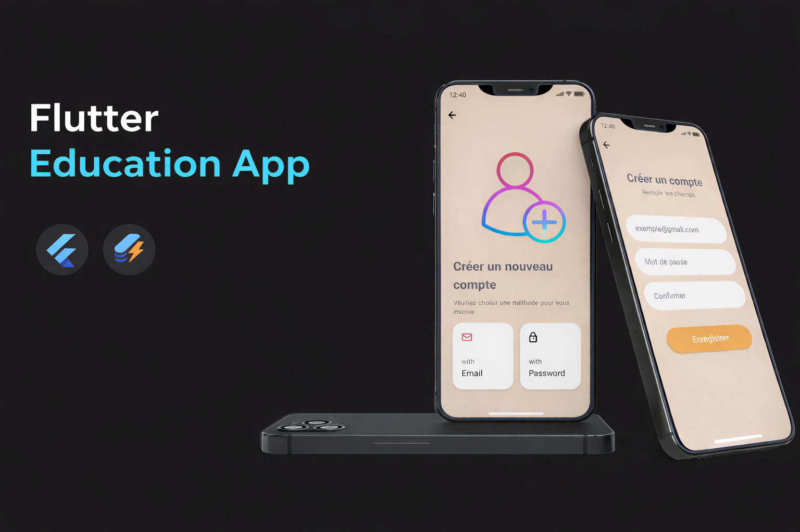

  

This project is a mobile application for teachers built with Flutter.
The application helps teachers manage educational activities such as classes, students, subjects, grades, and evaluations through a secure and easy-to-use mobile interface.

It was developed as an academic project (Mémoire) and focuses on improving the digital management of teaching activities.

## 📦 Tech Stack

### Mobile:

- `Flutter`
- `Dart`

### Backend:

- `Sqflite`

### UI & Tools:

- `Material Design`
- `Form Validation`
- `State Management`

## 🦄 Features

Here's what you can do with Flutter Education App:

- **User Authentication**: Teachers can securely log in to access the application and their personal data.

- **Class Management**: Create and manage classes assigned to teachers.

- **Student Management**: Add, update, and view student information.

- **Subject Management**: Manage subjects taught by each teacher.

- **Grade & Evaluation Management**: Record, update, and consult student grades and evaluations.

- **Educational Activity Tracking**: Organize and monitor teaching activities efficiently.

- **Mobile-Friendly Interface**: Use the application easily on mobile devices with a clean and intuitive UI.

## 👩🏽‍🍳 The Process

The project started with an analysis of teachers’ needs in managing educational activities.
Based on this analysis, I designed the application architecture and defined the main features required for effective teaching management.

Next, I implemented the authentication system to secure access to the application.
Then, I developed the core functionalities such as class management, student management, and grade handling, using Flutter and Dart.

Special attention was given to data organization, user navigation, and form validation to ensure reliability and ease of use.

Throughout the development, I documented each step as part of my academic mémoire, which helped me better understand the system and improve my technical and analytical skills.

## 📚 What I Learned

During this project, I gained strong experience in mobile application development and educational system design.

### Authentication & User Management:

- **Secure Access**: I learned how to implement user authentication and protect application features.

- **Session Logic**: Managing user sessions helped me understand access control in mobile apps.

### Flutter & Dart Development

- **UI Construction**: I learned how to build structured screens using Flutter widgets.

- **State Handling:**: Managing application state improved my understanding of dynamic UI updates.

### 📈 Overall Growth:

Each part of this project strengthened my ability to analyze requirements, design mobile solutions, and document technical work.
It was not only about coding, but also about understanding how technology can support education and teachers’ daily work.

## How can it be improved?

- Add role management (admin / teacher)
- Integrate attendance tracking
- Connect to a remote backend

## Running the Project

To run the project in your local environment, follow these steps:

1. Clone the repository: `git clone https://github.com/fetrafaneva/flutter_education_app.git`
2. Install dependencies:
       `flutter pub get`
   
3. Run the application:
       `flutter run`

## 📸 Screenshots

  
  &nbsp;&nbsp;&nbsp;&nbsp;&nbsp;
  

### Authentication Pages
The authentication pages allow users to log in or sign up easily using their email and password.  
Two login methods are available to ensure accessibility and security.

  
  &nbsp;&nbsp;&nbsp;&nbsp;&nbsp;
  

#### Email & Password Login
Users can access the application by entering their email and password.  
All required fields must be completed before tapping the **Log In** button.  
The clean and simple design provides an intuitive login experience.

#### Security Code (PIN) Login
Users can authenticate using a personal security code.  
The numeric keypad allows fast and secure input, while the delete button helps correct mistakes.  
This method adds an extra layer of protection for quick access.

  

### Dashboard
The dashboard serves as the main home page for organizing and managing educational data.  
It offers three main sections:

- **Class Management:** View and manage registered classes.  
- **Assessment Management:** Organize and track student assessments.  
- **Results Management:** Access and manage students’ results efficiently.

  
  &nbsp;&nbsp;&nbsp;&nbsp;&nbsp;
  

### Student Management Page
This page displays the details of a class (e.g., “Seconde”) with the total number of students and a detailed list.  
Each student is presented with a number, full name, and an icon for additional actions.  
A floating action button at the bottom right allows adding new students, while top icons manage class-specific options, such as adding subjects.

  
  &nbsp;&nbsp;&nbsp;&nbsp;&nbsp;
  

### Subject & Assessment Management
Manage subjects and assessments for a specific class.  
This allows organizing class content and tracking student performance efficiently.

  

### Adding a Student’s Grade
Teachers can add grades for students by selecting the subject and semester, entering the score, and adding comments.  
Once validated, the grade is saved to track academic performance efficiently.

  
  &nbsp;&nbsp;&nbsp;&nbsp;&nbsp;
  

### Student Details Page
Displays a student’s grades and information.  
- The student’s name appears at the top.  
- A table lists subjects with corresponding grades, with icons to edit or delete grades.  
- A selector allows choosing the assessment, and a floating action button lets users add new grades.

  

### Class Results Management
Provides an interface to manage academic results of different classes:  

- **View general class information:**  
  - Number of subjects  
  - Current school year  
  - Total number of students  

- **Access class-specific management:**  
  - View or modify subjects, assessments, or students’ results  

This page serves as a dashboard to navigate school data by class level.

  

### Student Results Management
Features include:

- Displaying general class information: subjects, school year, and total students  
- Listing students by number and full name  

  

### Student Grade Chart
Displays a student’s detailed academic performance:  
- Grades per subject  
- Overall average and class rank  
- Visual chart for strengths and weaknesses  
- Option to generate a PDF report for sharing or printing

  

### Student Search Page
Allows searching for students by name, ID, or other criteria.  
Search results are displayed in a clear list for easy selection and access to detailed information.

  

### Notes / Memo Page
Allows users to create, view, and manage notes or memos.  
Users can quickly add, edit, or delete notes, keeping all information organized and easily accessible.

  

### Data Import & Export Page
Enables users to import or export data files easily.  
Users can upload files to update the system or download data for backup, sharing, or offline use.  
The interface ensures smooth and secure data management.

  

### Application Help Page
Provides guidance on using the application, including instructions, tips, and explanations of features.  
Users can quickly find answers to common questions and navigate the app efficiently.
