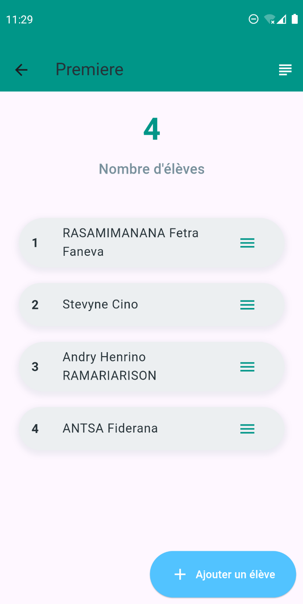
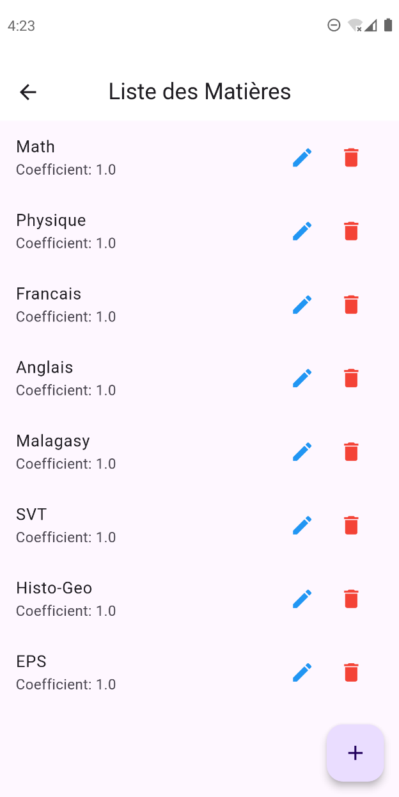
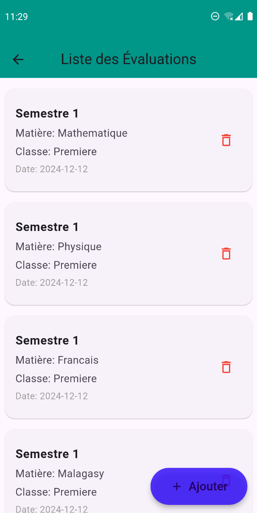
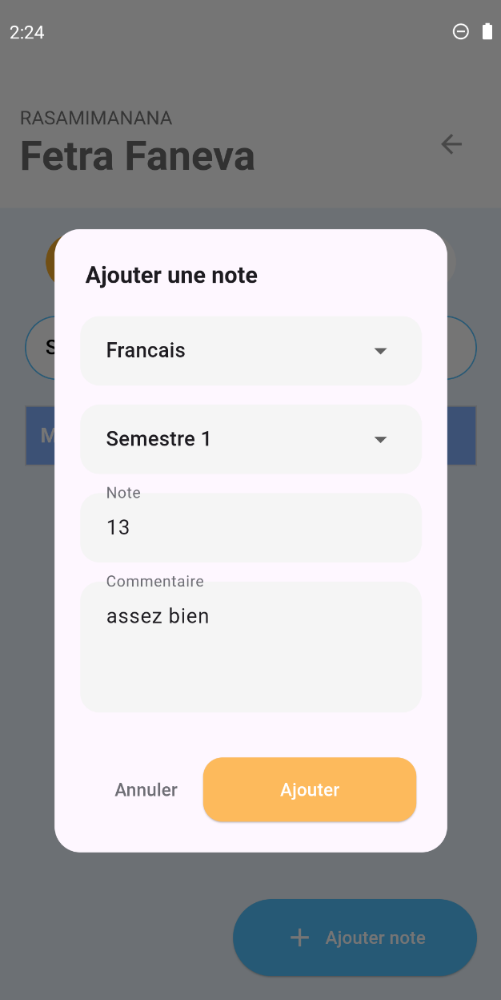
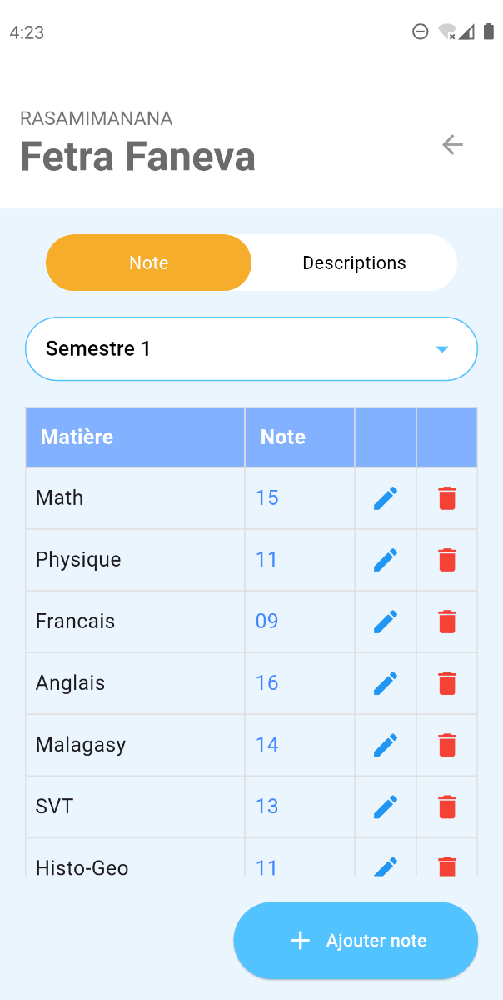
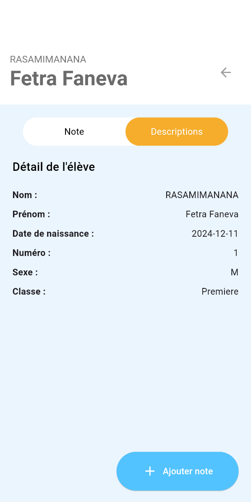

# Flutter Education App

This project is a mobile application for teachers built with Flutter.
The application helps teachers manage educational activities such as classes, students, subjects, grades, and evaluations through a secure and easy-to-use mobile interface.

It was developed as an academic project (Mémoire) and focuses on improving the digital management of teaching activities.

## 📦 Tech Stack

### Mobile:

- `Flutter`
- `Dart`

### Backend:

- `Sqflite`

### UI & Tools:

- `Material Design`
- `Form Validation`
- `State Management`

## 🦄 Features

Here's what you can do with Flutter Education App:

- **User Authentication**: Teachers can securely log in to access the application and their personal data.

- **Class Management**: Create and manage classes assigned to teachers.

- **Student Management**: Add, update, and view student information.

- **Subject Management**: Manage subjects taught by each teacher.

- **Grade & Evaluation Management**: Record, update, and consult student grades and evaluations.

- **Educational Activity Tracking**: Organize and monitor teaching activities efficiently.

- **Mobile-Friendly Interface**: Use the application easily on mobile devices with a clean and intuitive UI.

## 👩🏽‍🍳 The Process

The project started with an analysis of teachers’ needs in managing educational activities.
Based on this analysis, I designed the application architecture and defined the main features required for effective teaching management.

Next, I implemented the authentication system to secure access to the application.
Then, I developed the core functionalities such as class management, student management, and grade handling, using Flutter and Dart.

Special attention was given to data organization, user navigation, and form validation to ensure reliability and ease of use.

Throughout the development, I documented each step as part of my academic mémoire, which helped me better understand the system and improve my technical and analytical skills.

## 📚 What I Learned

During this project, I gained strong experience in mobile application development and educational system design.

### Authentication & User Management:

- **Secure Access**: I learned how to implement user authentication and protect application features.

- **Session Logic**: Managing user sessions helped me understand access control in mobile apps.

### Flutter & Dart Development

- **UI Construction**: I learned how to build structured screens using Flutter widgets.

- **State Handling:**: Managing application state improved my understanding of dynamic UI updates.

### 📈 Overall Growth:

Each part of this project strengthened my ability to analyze requirements, design mobile solutions, and document technical work.
It was not only about coding, but also about understanding how technology can support education and teachers’ daily work.

## How can it be improved?

- Add role management (admin / teacher)
- Integrate attendance tracking
- Connect to a remote backend

## Running the Project

To run the project in your local environment, follow these steps:

1. Clone the repository: `git clone https://github.com/fetrafaneva/flutter_education_app.git`
2. Install dependencies:
       `flutter pub get`
   
3. Run the application:
       `flutter run`

## 📸 Screenshots

  
  &nbsp;&nbsp;&nbsp;&nbsp;&nbsp; <!-- espace entre les images -->
  

The authentication page allows users to log in or sign up. Users can access their account easily using their email and password.

  
  &nbsp;&nbsp;&nbsp;&nbsp;&nbsp; <!-- espace entre les images -->
  

The application offers two types of login methods to ensure both accessibility and security for users.

### Email & Password Login

This screen allows users to access the application by entering their email address and password.
All required fields must be completed before tapping the “Log In” button.
The simple and clean design provides an intuitive and user-friendly login experience.

### Security Code Login

This screen enables users to authenticate using a personal security code.
The numeric keypad allows fast and secure input, while the delete button helps correct any mistakes.
This method adds an extra layer of protection and is ideal for quick access.

  

### Dashboard

This is the application home page that serves as the main dashboard for organizing and managing education-related data. It offers three main features:

Class Management: Allows users to view and manage registered classes.

Assessment Management: Helps organize and sort data related to student assessments.

Results Management: Facilitates the storage and access to students’ results for better organization.

  
  &nbsp;&nbsp;&nbsp;&nbsp;&nbsp; <!-- espace entre les images -->
  

### Student Management Page

This application page displays the management of a class (here, “Seconde”) with the total number of students (4) and a detailed list. Each student is presented with a number, their full name, and an icon for additional actions. At the bottom right, a floating action button allows adding a student, while icons at the top are used to manage options such as adding subjects to the corresponding class.

  
  &nbsp;&nbsp;&nbsp;&nbsp;&nbsp; <!-- espace entre les images -->
  

### Subject and Assessment Management Page
Here is the Assessment Management Page and the Class Subject Management Page for a specific class.

  

### Interface for adding a grade for a student.
This feature allows teachers to add a grade for a student. The user can select the subject and semester, enter the student’s score, and add a comment. Once validated, the grade is saved to help track and manage student academic performance efficiently.

  
  &nbsp;&nbsp;&nbsp;&nbsp;&nbsp; <!-- espace entre les images -->
  

### Page for displaying a student’s grades and information.
This section displays a student’s grade tracking with the student’s name shown at the top. A table lists the subjects and their corresponding grades, with icons to edit or delete each grade. A selector allows the user to choose the assessment, and a floating action button at the bottom right is used to add a new grade. The interface is clear and easy to use.

  

### Class Results Management Page.
The purpose of this section is to provide an interface for managing the academic results of different classes. It allows the user to:

View general class information:

- The number of subjects associated with each class.

- The current school year.

- The total number of students per class.

Access specific management for each class:

- By selecting a class, the user can view or modify the subjects, assessments, or students’ results associated with that class.

This page functions as a dashboard to organize and navigate school data by class level.

  

### Student Results Management Page.
The main features it offers are:

Display of general class information:

- Number of subjects taught in this class.

- Current school year.

- Number of students enrolled in the class.

Student list:

- Each student is listed by number and full name.

  

### Grade chart by assessment for a student.
This section displays a student’s detailed academic performance, showing their grades by subject.
It provides the overall average and the student’s rank within the class.
A chart allows for a quick visualization of the student’s strengths and weaknesses.
A button enables generating a PDF report for sharing or printing.

  

### Student search page.
This page allows users to search for a student by name, ID, or other criteria.
It displays the search results in a clear list, making it easy to select a student and access their detailed information.

